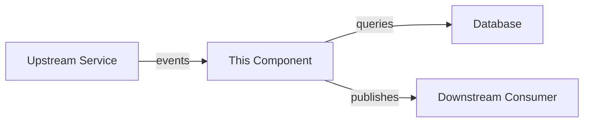
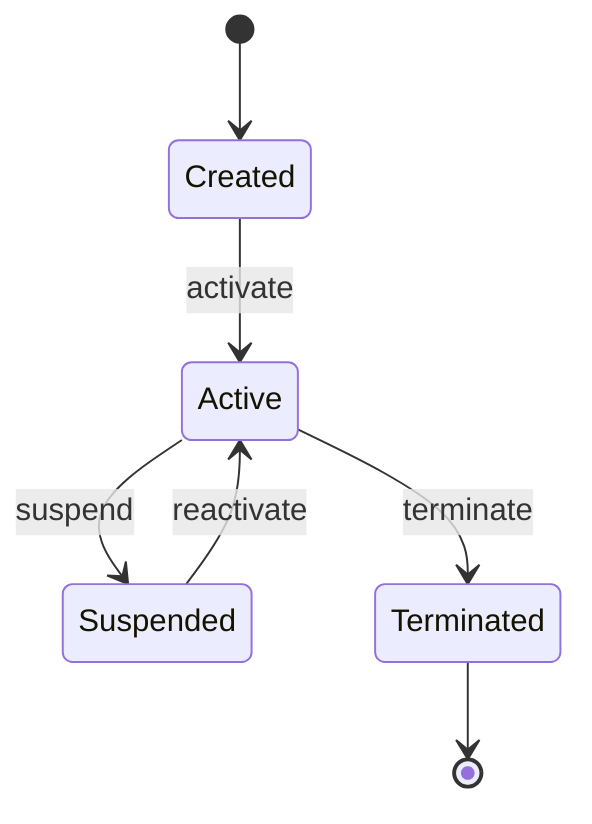

# Spec Template

Use this structure as the default. Adapt sections based on the component — not
every section applies to every component. Remove sections that don't apply rather
than writing "N/A." Add sections when the component demands them.

```markdown
# [Component Name] Specification

> **System:** [Parent system name]
> **Owner:** [Team or person]
> **Status:** Draft | Review | Approved
> **Last updated:** YYYY-MM-DD

## 1. Overview

One paragraph: what this component is, why it exists, and where it sits in the
larger system. Reference the architectural document.

## 2. Context

### System Context Diagram

Show this component's position relative to its neighbors. Use Mermaid or ASCII.



### Assumptions

Bulleted list of assumptions inherited from the architecture doc or discovered
during requirements gathering. Each assumption should be something that, if
wrong, would change the design.

### Constraints

Hard limits imposed by the environment, business, or architecture. Examples:
must use PostgreSQL, must run on AWS Lambda, must not exceed 200ms p99.

## 3. Functional Requirements

### FR-1: [Requirement Name]
**Description:** What the component must do.
**Trigger:** What initiates this behavior.
**Input:** What data/signals come in.
**Processing:** Step-by-step logic (pseudocode or prose).
**Output:** What the component produces or changes.
**Acceptance Criteria:**
- [ ] Given [precondition], when [action], then [outcome]
- [ ] Given [precondition], when [action], then [outcome]

### FR-2: [Requirement Name]
...

## 4. Non-Functional Requirements

### Performance
- Latency: [target, e.g., p50 < 100ms, p99 < 500ms]
- Throughput: [target, e.g., 1000 req/s]
- Resource budget: [memory, CPU, storage limits]

### Reliability
- Availability target: [e.g., 99.9%]
- Recovery time objective (RTO): [target]
- Recovery point objective (RPO): [target]
- Failure handling strategy: [retry, circuit-break, fallback]

### Security
- Authentication: [method]
- Authorization: [model, e.g., RBAC, ABAC]
- Data protection: [encryption at rest/in transit, PII handling]
- Audit: [what is logged, retention policy]

### Scalability
- Expected growth: [projections]
- Scaling strategy: [horizontal/vertical, auto-scaling triggers]

## 5. Interface Definitions

### Inbound Interfaces

#### [Interface Name] — [Protocol: REST | gRPC | Event | CLI | etc.]
- **Source:** Who/what calls this
- **Format:** Request/message schema (inline or reference)
- **Authentication:** How callers authenticate
- **Rate limits:** If applicable
- **Example:**
```json
{
  "example": "request payload"
}
```

### Outbound Interfaces

#### [Interface Name] — [Protocol]
- **Destination:** Who/what receives this
- **Format:** Response/message schema
- **Delivery guarantee:** at-most-once | at-least-once | exactly-once
- **Example:**
```json
{
  "example": "response payload"
}
```

## 6. Data Model

### Entities

#### [Entity Name]
| Field | Type | Constraints | Description |
|-------|------|-------------|-------------|
| id | UUID | PK | Unique identifier |
| ... | ... | ... | ... |

### State Machine (if applicable)



### Data Ownership
- **Owns:** [entities this component is the source of truth for]
- **Reads:** [entities owned elsewhere that this component references]

## 7. Error Handling

| Error Scenario | Detection | Response | Recovery |
|---------------|-----------|----------|----------|
| [scenario] | [how detected] | [immediate action] | [how to recover] |
| ... | ... | ... | ... |

### Idempotency
Describe which operations are idempotent and how idempotency is enforced
(idempotency keys, deduplication, etc.).

## 8. Observability

### Metrics
| Metric | Type | Description | Alert Threshold |
|--------|------|-------------|-----------------|
| [name] | counter/gauge/histogram | [what it measures] | [when to alert] |

### Logging
- Structured logging format and key fields
- Log levels and what triggers each

### Tracing
- Trace propagation strategy
- Key spans to instrument

## 9. Validation & Acceptance Criteria

### Critical Path Tests
Scenarios that MUST pass for the component to be considered functional:
1. [Scenario]: [expected outcome]
2. [Scenario]: [expected outcome]

### Integration Checkpoints
- [ ] [Upstream system] can successfully [action]
- [ ] [Downstream system] receives [expected output]
- [ ] [Monitoring] shows [expected metrics]

### Rollout Strategy
How this component should be deployed and verified in production.

## 10. Open Questions

| # | Question | Impact | Owner | Resolution |
|---|----------|--------|-------|------------|
| 1 | [question] | [what it affects] | [who decides] | [answer when resolved] |

## Appendix

### Glossary
Domain-specific terms used in this spec.

### References
- [Architecture Doc](path/to/ARCHITECTURE.md)
- [Related Spec](path/to/other-spec.md)
```

## Section Guidance

**Always include:** Overview, Context, Functional Requirements, Validation.
These are the minimum viable spec.

**Include when relevant:**
- Non-Functional Requirements — when there are performance, reliability, or security concerns
- Interface Definitions — when the component has external-facing APIs or event contracts
- Data Model — when the component owns persistent state
- Error Handling — when failure modes are non-obvious
- Observability — when the component runs in production

**Skip freely:** Open Questions (if none remain), Appendix (if no glossary needed).
